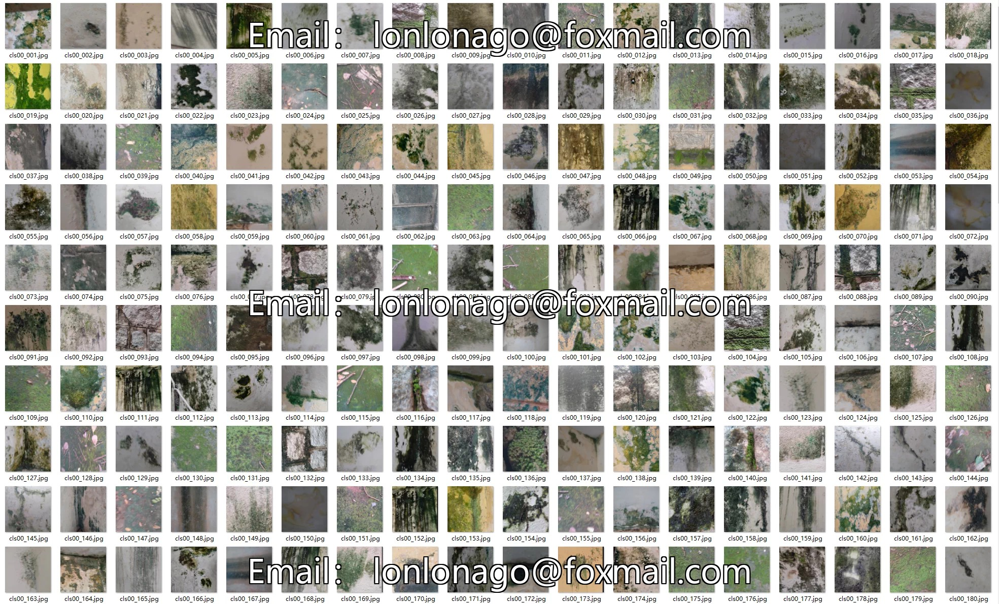
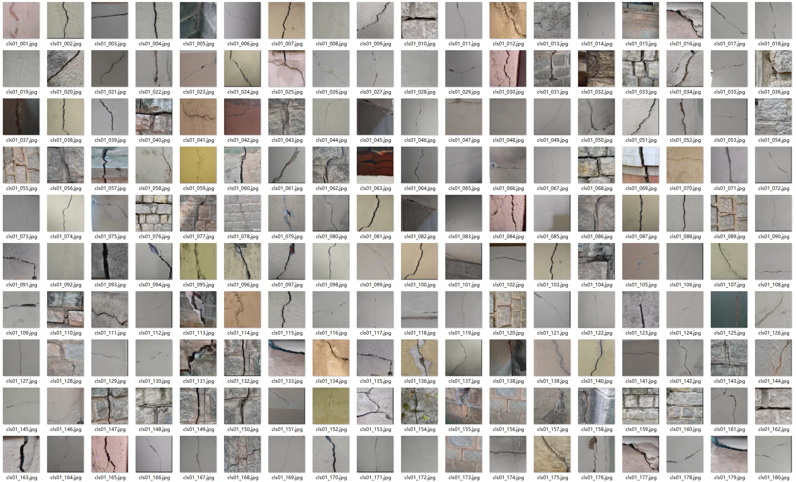
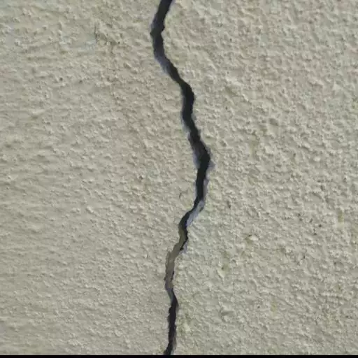
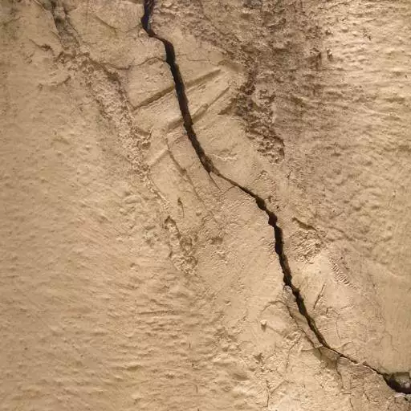
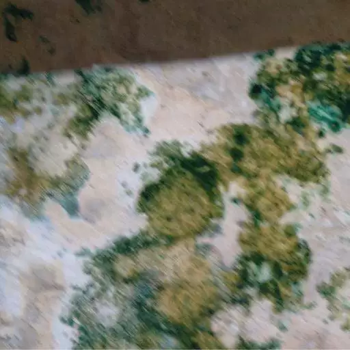
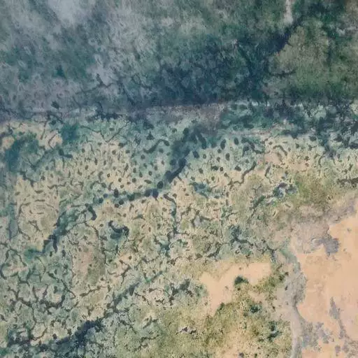

## Body

BD3 Building Defect Classification Dataset

Total images: 3965 RGB real-scene images, collected by mobile phones or drones on the exterior walls, stonework, and plastered surfaces of buildings.
This dataset consists of 7 major categories (6 defects + 1 intact without defects), with each image labeled for a single defect category.

algae	藻类 / 霉斑	Green mold and water-borne algae growing on the walls, common defects in humid exterior walls
major_crack	大裂缝（structural crack）	Deeply penetrating wide cracks through the wall, classified as structural safety issues
minor_crack	Fine cracks	Fine hairline cracks on the surface, only cracking of paint or plaster layers
peeling	Coating peeling off	Skinning and falling off of exterior coatings and plaster layers in large patches
plain(No Defect)	Undamaged wall surface	Standard undamaged wall surface without any diseases (negative samples, originally labeled No Defect, folder abbreviated plain)
spalling	Wall pitting / concrete collapse	Holes in the surface of mortar and concrete, loosening of aggregates, and honeycomb damage
stain	Watermarks / wall stains	Rust stains from rainwater seepage, black and yellow pollution spots

## Images

item_1055468802651

Here is a pay link on Stripe ( https://buy.stripe.com/3cs8yP7sY87d0vu9AB ). Please contact me lonlonago@foxmail.com after funding $89, and I will send you a complete data files , thank you!

